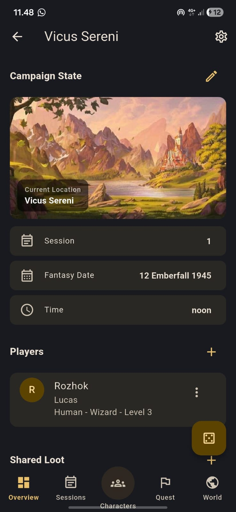
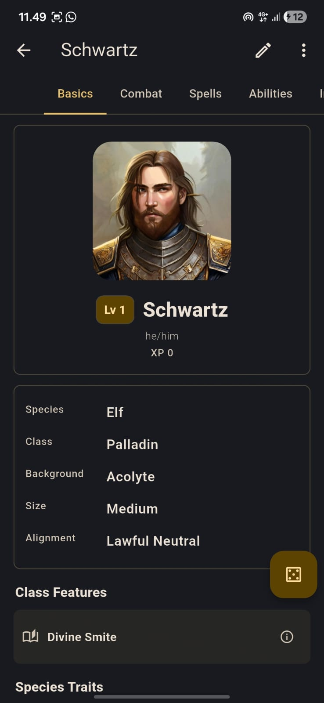
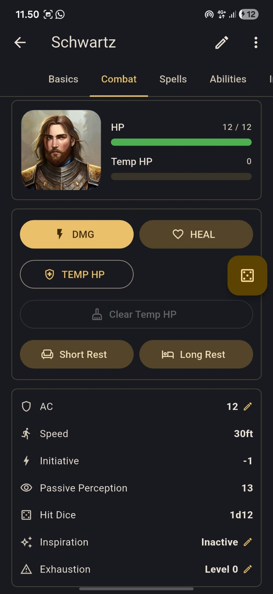
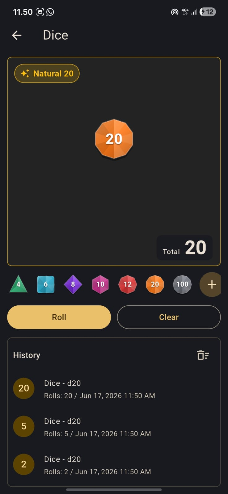

# Dungeonotes

<p align="left">
  
</p>

<p align="left">
  
  
  
</p>

**Dungeonotes** is an offline-first Flutter app for D&D and tabletop roleplaying campaign notes. It helps players and Dungeon Masters manage campaigns, sessions, quests, character sheets, NPCs, locations, inventory notes, manual spell notes, dice rolls, and campaign state without requiring internet access.

## App Preview

| Campaign                                                                                  | Character                                                                                   | Combat                                                                                | Dice                                                                              |
| ----------------------------------------------------------------------------------------- | ------------------------------------------------------------------------------------------- | ------------------------------------------------------------------------------------- | --------------------------------------------------------------------------------- |
|  |  |  |  |


## Table of Contents

* [Overview](#overview)
* [Highlights](#highlights)
* [Features](#features)
* [Tech Stack](#tech-stack)
* [Project Structure](#project-structure)
* [Getting Started](#getting-started)
* [Run the App](#run-the-app)
* [Build APK](#build-apk)
* [Development Seed Data](#development-seed-data)
* [Legal Note](#legal-note)

---

## Overview

Dungeonotes is designed for tabletop roleplaying groups that need a simple, local, and lightweight campaign tracker. The app focuses on helping users organize their own campaign information instead of providing an official rulebook database.

All data is stored locally on the device, making the app usable during offline sessions, in places with unstable internet, or for players who prefer a private note-taking workflow.

---

## Highlights

* Offline-first local data storage with Hive.
* No internet requirement for core usage.
* Campaign tracker for sessions, quests, characters, NPCs, locations, shared loot, and history.
* Lightweight D&D-style character sheets with reusable sheet data and campaign-specific runtime state.
* Dice roller with local roll history.
* JSON import/export support.
* Local image support for campaign covers.
* Responsive Material 3 UI with light and dark theme support.
* No official rulebook database or copyrighted rules content.

---

## Features

### Campaign Management

* Create, edit, delete, and search campaigns.
* Add optional 16:9 local cover images.
* View campaign overview and related notes.
* Track sessions, quests, characters, NPCs, and locations.
* Store shared loot and campaign timeline/history.

### Session Notes

* Add session date, recap, important events, loot, and next-session reminders.
* Search session notes.
* Sort sessions by newest or oldest.
* Use quick recap capture for fast note-taking during gameplay.

### Quest Tracker

* Track quests with multiple statuses:

  * Active
  * Completed
  * Failed
  * On hold
* Filter quests by status.
* Link quests with existing NPCs and locations.
* Support manual text for flexible campaign notes.

### Character Sheets

* Create reusable character sheets.
* Link one character sheet to one or more campaigns.
* Manage campaign-specific runtime state separately from the base sheet.
* Track identity, level, species/class/background text, HP, defenses, ability scores, attacks, actions, features, skills, inventory, treasure, tools, languages, personality notes, and spell notes.
* Use a multi-step character creation flow.
* Select level from 1 to 20.
* Automatically derive proficiency bonus from level.
* Calculate spellcasting DC and attack summaries from ability scores.
* Track death saves, armor, shield, size, skill proficiency, expertise, saving throw proficiency, and coins.

### Campaign Runtime State

Campaign-linked characters can track temporary gameplay state such as:

* Current HP
* Temporary HP
* Conditions
* Death saves
* Rest state
* Expended spell-slot notes

This keeps the reusable character sheet clean while allowing each campaign to have its own state.

### NPC and Location Notes

* Manage NPC notes separately from character sheets.
* Manage location notes for campaign places.
* Reference NPCs and locations from sessions and quests.

### Dice Roller

* Roll common tabletop dice:

  * d4
  * d6
  * d8
  * d10
  * d12
  * d20
  * d100
* Add manual modifiers.
* View animated dice feedback.
* Store local roll history, capped at 20 rolls.
* Show natural 20 and natural 1 feedback.
* Access dice quickly from the main bottom navigation and campaign workflows.

### Settings

* System, light, and dark theme options.
* Clear all local data.
* Legal note page.
* Loading, empty, success, error, and confirmation states across the app.

---

## Tech Stack

| Category          | Technology          |
| ----------------- | ------------------- |
| Framework         | Flutter             |
| Language          | Dart                |
| State Management  | Riverpod            |
| Local Database    | Hive / Hive Flutter |
| Navigation        | GoRouter            |
| Local Preferences | shared_preferences  |
| Formatting        | intl                |
| UI System         | Material 3          |

---

## Project Structure

```text
lib/
  core/
    constants/
    errors/
    theme/
    utils/
    widgets/
  data/
    local/
    models/
    repositories/
  features/
    campaigns/
    sessions/
    quests/
    characters/
    npc_locations/
    dice_roller/
    onboarding/
    settings/
  app.dart
  main.dart
```

---

## Getting Started

### Prerequisites

Make sure you have installed:

* Flutter SDK
* Dart SDK
* Android Studio or VS Code
* Android Emulator or physical Android device
* Git

Check your Flutter installation:

```bash
flutter doctor
```

If there are missing Android licenses, run:

```bash
flutter doctor --android-licenses
```

---

## Run the App

Install dependencies:

```bash
flutter pub get
```

Run the app:

```bash
flutter run
```

Run on a specific connected device:

```bash
flutter devices
flutter run -d DEVICE_ID
```

---

## Build APK

To build a release APK:

```bash
flutter build apk --release
```

The output APK will usually be available at:

```text
build/app/outputs/flutter-apk/app-release.apk
```

To build a debug APK:

```bash
flutter build apk --debug
```

To clean the project before rebuilding:

```bash
flutter clean
flutter pub get
flutter build apk --release
```

To generate smaller APK files for different Android CPU architectures:

```bash
flutter build apk --release --split-per-abi
```

---

## Development Seed Data

Dungeonotes supports optional development seed data for testing.

Run with seed data enabled:

```bash
flutter run --dart-define=DUNGEONNOTES_ENABLE_DEV_SEED=true
```

Production builds should omit this flag so the app starts empty:

```bash
flutter run
```

or:

```bash
flutter build apk --release
```

---

## Legal Note

Dungeonotes is an unofficial tabletop roleplaying campaign tracker. It is not affiliated with, endorsed, sponsored, or approved by Wizards of the Coast.

This app does not include official rulebook content, copyrighted rules database, or official D&D content. Users create and manage their own notes, characters, quests, sessions, locations, NPCs, inventory notes, manual spell notes, and campaign information.

---

## Status

Dungeonotes is currently developed as a portfolio project and offline-first TTRPG campaign management app.

Future improvements may include:

* More advanced import/export options.
* Better campaign dashboard analytics.
* More customizable character sheet fields.
* Additional note templates.
* Improved tablet layout.
* Optional backup workflow.

---

## Author

Developed by **Daniel Ridho Abadi**.
